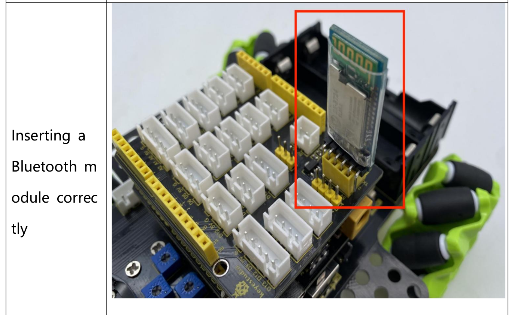

# robo car
 The COOLEST robo car code EVER >:) Specifically pitched at my KS0551 Keyestudio robo car

[Arduino Libraries](https://www.dropbox.com/sh/sdlgtym49vvh0qx/AADEx_4IiABLLvVA_lS9U_mHa/Libraries?dl=0&subfolder_nav_tracking=1)

# Python
Run the python code main.py alongside the robot car for coolness!

Make sure you install the python stuff with `pip install -r requirements.txt`!

For ease of reference:

